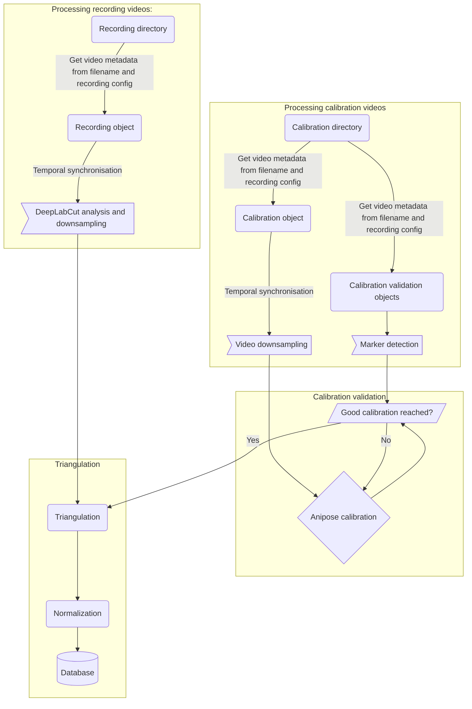

# let_it_be_3D

With let_it_be_3D we want to extend the functions of aniposelib and bring them into a pipeline structure.
As less manual steps required as possible, standardized quality assurance and collection of metadata.
- video synchronisation
- framerate adjustment
- calibration validation
- manual marker detection
- filename checker
- normalisation

 See the pipeline flowchart! 

 Pipeline explained Step-by-Step! 

### 1) Load videos and metadata
- read video metadata from [filename](#filename_structure) and recording config file
- intrinsic calibrations
    - use anipose intrinsic calibration
    - run or load intrinsic calibration based on uncropped checkerboard videos (undistorted image???) 
    adjust intrinsic calibration for video cropping

### 2) Video processing
- synchronize videos temporally based on a blinking signal 
    

    
Example 

        

        
        

    

- run marker detection on videos manually or using DeepLabCut networks (DLC label), (2D dataframes)
- write videos and marker detection files to the same framerate

### 3) Calibration
- run extrinsic Anipose camera calibration (anipose label)
- validate calibration based on known distances and angles (ground truth) between calibration validation markers (calvin image!)
    

    
Example 

        This calibration validation shows the triangulated representation of a tracked rectangle, that has 90° angles at the corners.
        

        
        

    

### 4) Triangulation
- triangulate recordings (3D dataframes)
- rotate dataframe, translate to origin, normalize to centimeter
    

    
Example 

    
        

        
        

    

    
- add metadata to database

## How to use
### Installation

### Examples

### Required filestructure
#### Video filename

#### Folder structure

### API Documentation
Please see our API-documentation [here](https://let-it-be-3d.readthedocs.io/en/latest/)!

## Why 3D?

## Contributers
The pipeline was designed by [Konstantin Kobel](https://github.com/KonKob), [Dennis Segebarth](https://github.com/DSegebarth) and [Michael Schellenberger](https://github.com/MSchellenberger).
At the Sfb-Retune Hackathon 2022, [Elisa Garulli](https://github.com/ELGarulli), [Robert Peach](https://github.com/peach-lucien) and [Veronika Selzam](https://github.com/vselzam)
joined the taskforce to push the project towards completion. 

<table>
<tr>
<td>
    
</td> 
<td>
    
</td>
</tr>
</table>

## Contact
If you want to help with writing this pipeline, please <a href = "mailto: schellenb_m1@ukw.de">get in touch</a>.
